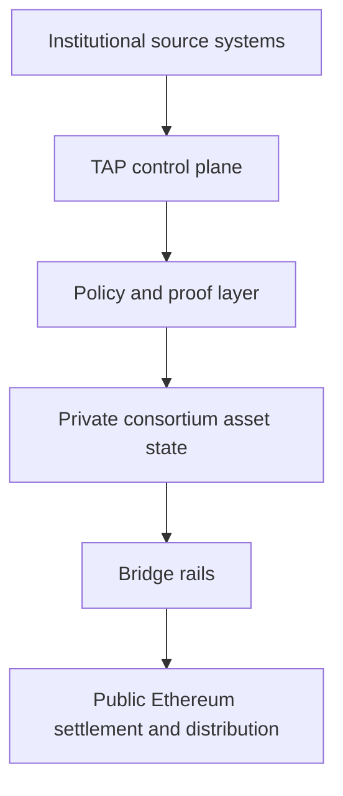
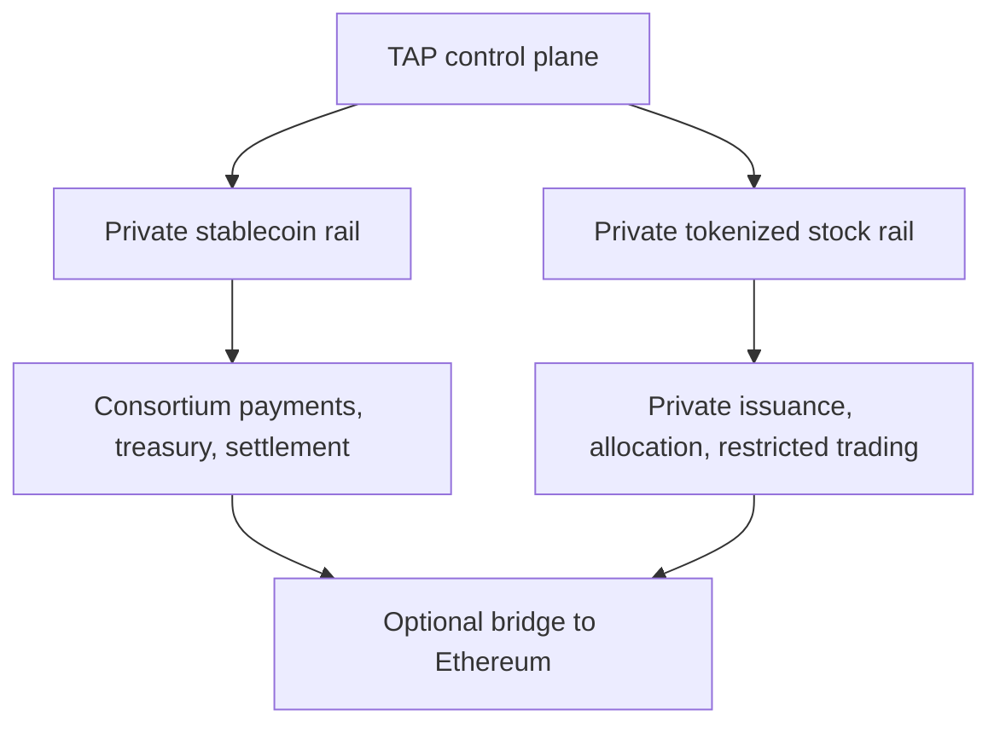
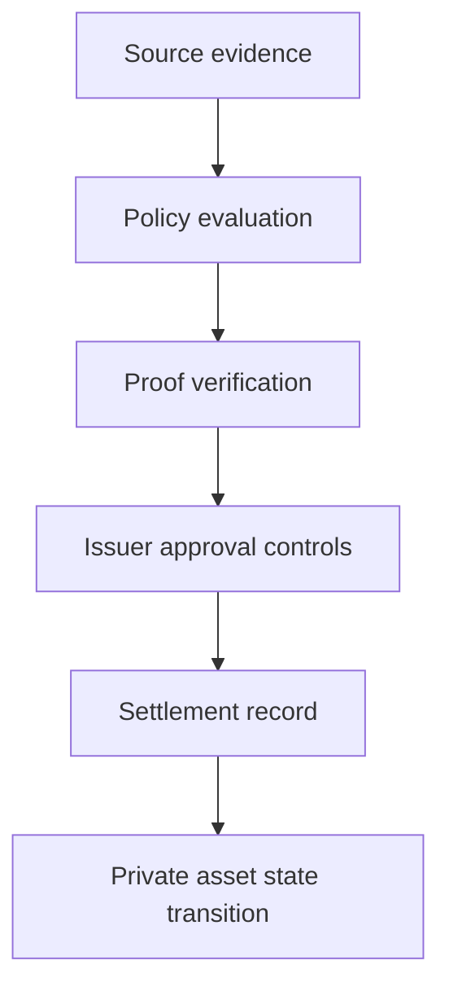
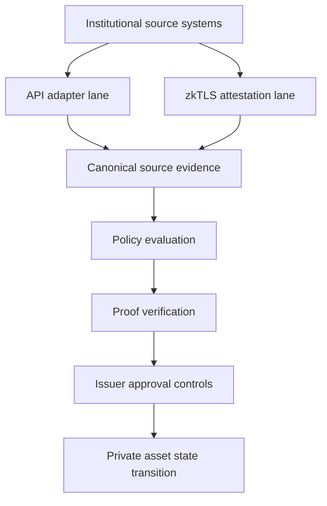

# Tokenized Asset Protocol (Pilot Scaffold)

TAP is a self-hostable control plane for private, permissioned tokenized assets.

It is built for the model we expect institutions to actually want: private consortium stablecoins, private tokenized stocks and funds, proof-linked compliance, verifiable off-chain source inputs, and optional bridge rails to public Ethereum when interoperability matters.

## Why TAP

The current public-chain tokenization model is easy to launch and easy to copy.

It is also increasingly weak for institutions because it is:

- public by default
- hard to differentiate
- edge-gated instead of policy-native
- poor at protecting customer and ecosystem data
- structurally commoditizing for issuers

TAP is designed around a different model:

- stablecoins as the private cash leg
- tokenized stocks and funds as the private risk-asset leg
- source truth kept off-chain
- policy made explicit, versioned, and auditable
- state transitions governed by proofs and approvals
- Ethereum used as a bridge rail, not the full operating system

## Architecture

### Private operating layer and public bridge rails



### Parallel asset model



### Decision flow



### API adapter and zkTLS input lanes



## What’s In The Repo

### Apps

- `apps/api-gateway`: main TAP control plane API
- `apps/issuer-console`: issuer and operator UI
- `apps/user-wallet`: end-user wallet UI
- `apps/auditor-portal`: verification and audit UI

### Core packages

- `packages/policy-engine`: versioned policy registry and policy hashing
- `packages/prover-service`: proof generation and verification lanes
- `packages/source-adapters`: partner API and generic REST adapter layer
- `packages/attestor-service`: statement, phone, and zkTLS attestation handling
- `packages/compliance-engine`: policy evaluation and decision logic
- `packages/contracts`: settlement and future zkApp boundary
- `packages/bridge-service`: private-to-public bridge orchestration boundary

### Operational surface

- one-command flagship pilot packs
- customer sandbox mapping templates
- public transcript packs
- bank onboarding and pilot collateral
- launch docs and architecture writeups

## Run The Flagship Pilot

The quickest way to understand TAP is to run the dual-asset flagship pilot.

```bash
./scripts/run_dual_asset_flagship_pack.sh
```

That flow proves:

- private stablecoin workflow controls
- private tokenized stock lifecycle controls
- one shared policy, proof, approval, and settlement control plane

For the broader release-oriented pack:

```bash
./scripts/run_enterprise_demo_pack.sh
```

For detailed operator steps, use:

- `docs/flagship-runbook.md`
- `docs/runbook.md`

## Bring Your Own Sandbox

TAP is meant to be adapted to a bank, issuer, broker, custodian, or consortium’s own systems.

The customer integration path is:

1. fill out the onboarding packet
2. map the customer’s API or HTTPS source into TAP
3. run a customer-owned pilot transcript
4. convert that pilot into a production integration plan

Start here:

- `docs/bank-sandbox-onboarding-packet.md`
- `docs/customer-sandbox-mapping-kit.md`
- `docs/first-customer-integration-template.md`
- `docs/examples/customer-owned-dual-asset-sandbox-example.md`

## Key Docs

If you are new to the repo, start with these:

- `docs/blog-private-tokenized-asset-protocol.md`
- `docs/flagship-runbook.md`
- `docs/provider-strategy.md`
- `docs/spec/README.md`
- `docs/status-and-next-steps.md`
- `docs/external-zktls-adaptations.md`
- `docs/launch/`

## Current State

This repository is a pilot scaffold, not a finished production deployment.

What is already real:

- dual-asset stablecoin + tokenized stock workflow surface
- policy-linked settlement checks
- maker-checker issuer controls
- real `o1js` runtime lanes
- zkTLS-backed source integration
- customer-owned sandbox onboarding path

What is still intentionally incomplete:

- full production bridge implementation
- production persistence and observability hardening
- customer-specific live sandbox integrations beyond reference paths

## License

Apache-2.0. See `LICENSE`.
