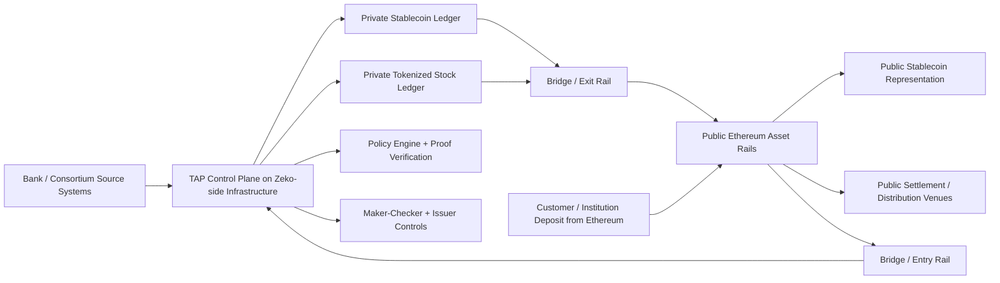
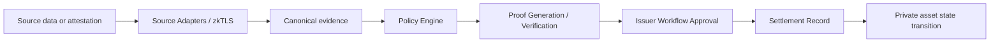
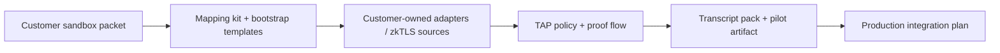

# Tokenized Asset Protocol (Pilot Scaffold)

Private sovereign rollup protocol scaffold for consortium stablecoin issuance with privacy-preserving compliance proofs and Ethereum bridge rails.

## Goals

- Permissioned mint/burn by consortium issuers only
- Private transfer settlement with proof-based compliance checks
- Attested identity/balance inputs (upload + phone + zkTLS-ready adapters)
- Bridge path to public Ethereum stablecoin rails
- Forkable infrastructure and local demo workflow

## Architecture Snapshots

### Private control plane and public bridge rails



### Proof-linked state transition flow



### Customer sandbox onboarding path



## Delivery Model (Self-Hosted)

This project is packaged for bank/consortium teams to run themselves.

- Protocol spec: `docs/spec/`
- Flagship demo plan: `docs/flagship-demo-plan.md`
- Flagship runbook: `docs/flagship-runbook.md`
- Status and next steps: `docs/status-and-next-steps.md`
- Deployment and operations kits: `docs/kits/`
- Production gates: `docs/production-readiness.md`
- Self-hosting guide: `docs/self-hosting.md`
- Provider strategy: `docs/provider-strategy.md`
- External zkTLS adaptations: `docs/external-zktls-adaptations.md`
- Architecture blog post: `docs/blog-private-tokenized-asset-protocol.md`
- Launch assets: `docs/launch/`
- Bank onboarding playbook: `docs/bank-onboarding-playbook.md`
- Bank sandbox onboarding packet: `docs/bank-sandbox-onboarding-packet.md`
- Customer sandbox mapping kit: `docs/customer-sandbox-mapping-kit.md`
- First customer integration template: `docs/first-customer-integration-template.md`
- Prefilled example, customer-owned dual-asset sandbox: `docs/examples/customer-owned-dual-asset-sandbox-example.md`
- Prefilled example, stablecoin pilot: `docs/examples/bank-balance-stablecoin-pilot.md`
- Prefilled example, tokenized equity pilot: `docs/examples/identity-gated-tokenized-equity-pilot.md`
- Stablecoin pilot proposal: `docs/examples/bank-balance-stablecoin-pilot-proposal.md`
- Stablecoin pilot checklist: `docs/examples/bank-balance-stablecoin-pilot-checklist.md`
- Stablecoin pilot memo: `docs/examples/bank-balance-stablecoin-pilot-memo.md`
- Stablecoin pilot deck outline: `docs/examples/bank-balance-stablecoin-pilot-deck-outline.md`
- Stablecoin pilot slides: `docs/examples/bank-balance-stablecoin-pilot-slides.md`
- Stablecoin pilot one-pager: `docs/examples/bank-balance-stablecoin-pilot-one-pager.md`
- Tokenized equity pilot proposal: `docs/examples/identity-gated-tokenized-equity-pilot-proposal.md`
- Tokenized equity pilot checklist: `docs/examples/identity-gated-tokenized-equity-pilot-checklist.md`
- Tokenized equity pilot memo: `docs/examples/identity-gated-tokenized-equity-pilot-memo.md`
- Tokenized equity pilot deck outline: `docs/examples/identity-gated-tokenized-equity-pilot-deck-outline.md`
- Tokenized equity pilot slides: `docs/examples/identity-gated-tokenized-equity-pilot-slides.md`
- Tokenized equity pilot one-pager: `docs/examples/identity-gated-tokenized-equity-pilot-one-pager.md`

## Monorepo Layout

- `apps/issuer-console` issuer/admin UI
- `apps/user-wallet` end-user UI
- `apps/auditor-portal` verifier/auditor UI
- `apps/api-gateway` protocol API (golden-flow endpoints)
- `apps/indexer` event/indexer API (starter)
- `packages/contracts` settlement registry module and future zkApp bindings
- `packages/circuits` o1js circuit scaffolds
- `packages/prover-service` real proof generation/verification service
- `packages/o1js-verifier` pluggable verifier CLI for `zk-o1js-proof` envelopes
- `packages/attestor-service` statement/phone/zkTLS attestation adapters
- `packages/source-adapters` partner API adapter layer (`mock-bank`, `generic-rest`, `plaid`, `persona`, `custody-holdings`)
- `packages/tenant-config` tenant-scoped provider config store (DB-ready interface)
- `packages/policy-engine` versioned policy registry + deterministic policy hash
- `packages/bridge-service` rollup <-> Ethereum bridge orchestrator
- `packages/compliance-engine` policy evaluation module
- `packages/shared-types` shared schema/contracts
- `packages/sdk` typed client
- `packages/ui-kit` reusable UI components

## Proof Modes

Set `PROOF_MODE` in `.env`:

- `crypto` (default): real cryptographic HMAC-backed proof artifacts with deterministic verification.
- `mock`: mock proof artifacts for fast UI/dev iteration.
- `zk`: circuit-signed proof envelope mode (Ed25519 statement proofs) with deterministic local verification.
  - also supports `zk-o1js-proof` verification payloads when `ZK_O1JS_VERIFY_CMD` is configured.
  - optional guard: `ZK_O1JS_VERIFICATION_KEY_HASH=<expected_vk_hash>`.
  - packaged verifier CLI: `node ./packages/o1js-verifier/dist/cli.js`
  - actual runtime mode: set `ZK_PROVER_BACKEND=o1js`, `ZK_O1JS_PROVE_CMD`, `ZK_O1JS_VERIFIER_MODE=o1js-runtime`, and `ZK_O1JS_MODULE=o1js`.

## Golden Flow (working now)

1. User creates `eligibility_v1` proof via API.
2. Proof is verified locally by prover service.
3. Settlement is recorded with proof hash + event + tx-like id in registry storage.
4. Auditor portal reads and validates recent settlement artifacts.

## Quick Start

1. Copy env:

```bash
cp .env.example .env
```

2. Install:

```bash
pnpm install
```

3. Run all dev services:

```bash
pnpm dev
```

4. Open UIs:

- Issuer: `http://localhost:5173`
- User wallet: `http://localhost:5174`
- Auditor: `http://localhost:5175`

## API Highlights

- `POST /api/v1/proof/eligibility`
- `POST /api/v1/proof/verify`
- `POST /api/v1/settlement/record`
- `GET /api/v1/settlement/recent`
- `GET /api/v1/auditor/events`

Run the golden flow from CLI:

```bash
./scripts/run_golden_flow.sh
```

Policy-linked settlement demo scripts:

```bash
./scripts/bootstrap_policy_seed.sh
./scripts/bootstrap_identity_persona.sh
./scripts/bootstrap_holdings_custody.sh
./scripts/bootstrap_customer_balance_template.sh
./scripts/bootstrap_customer_kyc_template.sh
./scripts/bootstrap_customer_holdings_template.sh
./scripts/run_customer_balance_template.sh
./scripts/run_customer_kyc_template.sh
./scripts/run_customer_holdings_template.sh
./scripts/generate_customer_dual_asset_transcript.sh
./scripts/bootstrap_customer_dual_asset_policies.sh
./scripts/run_customer_dual_asset_demo_pack.sh
./scripts/bootstrap_risk_controls.sh
./scripts/run_policy_linkage_demo.sh
./scripts/run_persona_identity_demo.sh
./scripts/run_holdings_custody_demo.sh
./scripts/run_routing_failover_demo.sh
./scripts/run_issuer_sla_reconcile_demo.sh
./scripts/run_partner_adapter_certification.sh
./scripts/run_zk_mode_demo.sh
./scripts/run_zk_o1js_reference_demo.sh
./scripts/generate_zk_o1js_runtime_transcript.sh

# Real o1js runtime mode
ZK_PROVER_BACKEND=o1js \
ZK_O1JS_PROVE_CMD="node $(pwd)/packages/circuits/dist/prove-cli.js" \
ZK_O1JS_VERIFY_CMD="node $(pwd)/packages/o1js-verifier/dist/cli.js" \
ZK_O1JS_VERIFIER_MODE=o1js-runtime \
ZK_O1JS_MODULE=o1js \
pnpm --filter @tap/api-gateway dev

./scripts/run_zk_o1js_runtime_demo.sh
./scripts/generate_zk_o1js_runtime_transcript.sh
./scripts/run_release_audit_bundle.sh
./scripts/generate_policy_demo_transcript.sh
./scripts/run_maker_checker_demo.sh
./scripts/generate_maker_checker_transcript.sh
./scripts/run_stock_lifecycle_demo.sh
./scripts/generate_stock_lifecycle_transcript.sh
./scripts/run_stock_lifecycle_demo_pack.sh
./scripts/generate_persona_identity_transcript.sh
./scripts/run_persona_identity_demo_pack.sh
./scripts/generate_holdings_custody_transcript.sh
./scripts/run_holdings_custody_demo_pack.sh
./scripts/generate_dual_asset_flagship_transcript.sh
./scripts/run_dual_asset_flagship_pack.sh
./scripts/generate_issuer_sla_reconcile_transcript.sh
./scripts/generate_partner_adapter_certification_transcript.sh
./scripts/run_demo_pack.sh
```

Maker-checker transcript options:
- `RESET_LOCAL_STATE=1` (default) clears local file-backed settlement/audit files before capture for cleaner outputs.
- `REDACT_PUBLIC_COPY=1` (default) generates a redacted companion transcript (`*.public.md`) suitable for external sharing.

Policy transcript options:
- `RESET_DEMO_STATE=1` (default) calls `POST /api/v1/admin/demo/reset` before capture.

One-command transcript pack:
- `./scripts/run_demo_pack.sh` generates policy-linkage + maker-checker + stock lifecycle + zk runtime transcript bundles in one run.
- `./scripts/run_stock_lifecycle_demo_pack.sh` starts an isolated API on a fixed port, waits for health, runs the stock lifecycle transcript, verifies it, and shuts the API down.
- `./scripts/run_persona_identity_demo_pack.sh` runs the identity reference path end-to-end with an isolated API plus local Persona mock. Override `PERSONA_API_KEY`, `PERSONA_WEBHOOK_SECRET`, and `PERSONA_BASE_URL` to point at a real sandbox.
- `./scripts/run_holdings_custody_demo_pack.sh` runs the holdings reference path end-to-end with an isolated API plus local custody mock. Override `CUSTODY_API_KEY`, `CUSTODY_WEBHOOK_SECRET`, and `CUSTODY_BASE_URL` to point at a real sandbox.
- `./scripts/bootstrap_customer_balance_template.sh`, `./scripts/bootstrap_customer_kyc_template.sh`, and `./scripts/bootstrap_customer_holdings_template.sh` are near-copy/paste starting points for the first customer-owned sandbox integration. They register reusable `generic-rest` auth profiles and print example `/attest/source/collect` payloads.
- `./scripts/run_customer_balance_template.sh`, `./scripts/run_customer_kyc_template.sh`, and `./scripts/run_customer_holdings_template.sh` are matching customer-owned source runners for the first real integration.
- `./scripts/generate_customer_dual_asset_transcript.sh` captures the bootstrap + balance + KYC + holdings pattern into one customer-owned dual-asset transcript.
- `./scripts/run_customer_dual_asset_demo_pack.sh` is the one-command version of that week-1 customer integration path, using a local mock customer sandbox to prove the flow end to end.
- `./scripts/run_dual_asset_flagship_pack.sh` starts an isolated API on a fixed port, runs the stablecoin plus stock flagship transcript, verifies it, and copies the redacted flagship artifact into `output/demo-transcripts/public-pack/`.
- `PLAID_ACCESS_TOKEN=... ./scripts/run_enterprise_demo_pack.sh` generates the dual-asset flagship artifact plus the supporting policy-linkage, maker-checker, stock lifecycle, issuer-sla-reconcile, partner-adapter-certification, and Plaid bundles, then copies public-safe artifacts to `output/demo-transcripts/public-pack/`.
- by default, the enterprise pack also includes the customer-owned dual-asset artifact generated from the local mock customer sandbox, so the pack shows both the product story and the “bring us your sandbox” integration path.
- optional: set `PERSONA_ENABLED=1` and/or `CUSTODY_ENABLED=1` to include identity and holdings reference artifacts in the enterprise pack. By default these use local mock-backed reference flows; override the provider base URLs and secrets to point at a real sandbox.
- `output/demo-transcripts/public-pack/README.md` explains what is in the public pack and points readers to the flagship artifact first.
- `PLAID_CLIENT_ID=... PLAID_SECRET=... PLAID_ACCESS_TOKEN=... ./scripts/run_v1_demo_rc1.sh` runs the full operator flow (isolated API start, enterprise pack, release bundle creation, and bundle verification).
- `./scripts/preflight_v1_demo.sh` runs deterministic preflight checks. Use `RUN_RUNTIME=1` with a running API to include runtime/auth/policy/Plaid smoke checks.
- optional: `BUILD_RELEASE_AUDIT_BUNDLE=1 PLAID_ACCESS_TOKEN=... ./scripts/run_enterprise_demo_pack.sh` also creates a release audit bundle tarball.
- `./scripts/verify_transcript.sh <transcript.md>` validates transcript integrity (`failed: 0` + all `[exit_code=0]`) and prints `sha256`.

Reference o1js verifier command wiring:

```bash
pnpm --filter @tap/o1js-verifier build
export ZK_O1JS_VERIFICATION_KEY_HASH='vk_hash_demo'
export ZK_O1JS_VERIFY_CMD="node /Users/evankereiakes/Documents/Codex/tokenized-asset-protocol/packages/o1js-verifier/dist/cli.js"
```

Actual `o1js` runtime wiring:

```bash
pnpm --filter @tap/o1js-verifier build
export ZK_O1JS_VERIFY_CMD="node /Users/evankereiakes/Documents/Codex/tokenized-asset-protocol/packages/o1js-verifier/dist/cli.js"
export ZK_O1JS_VERIFIER_MODE='o1js-runtime'
export ZK_O1JS_MODULE='o1js'
export ZK_O1JS_VERIFICATION_KEY_HASH='...'
export ZK_O1JS_VERIFICATION_KEY_JSON_BASE64='...'
```

Run zk-o1js proof verification demo (against a running `PROOF_MODE=zk` API):

```bash
./scripts/run_zk_o1js_reference_demo.sh
./scripts/run_zk_o1js_runtime_demo.sh
```

These show:
- successful settlement with active policy snapshot
- explicit rejection for stale/missing policy linkage

## zkTLS Integration (from zk-verify-poc)

This repo can run and ingest artifacts from:
- `/Users/evankereiakes/Documents/Codex/tokenized-asset-protocol/external/zk-verify-poc`

Endpoints:
- `GET /api/v1/attest/zktls/status`
- `GET /api/v1/attest/zktls/latest`
- `POST /api/v1/attest/zktls/run`

`/attest/zktls/run` executes `moon run workspace:run` (or `workspace:run-ineligible`) in the external repo and returns latest artifacts (`attestation`, `disclosed-fields`, `proof`, `verification-key`, `settlement`) for ingestion into this protocol demo.

## Current Constraints

- This environment is offline, so dependency install and live testnet deployment are not executed here.
- Settlement anchoring currently writes to local registry storage (`output/settlements.json`).
- `PROOF_MODE=zk` now works with circuit-signed proof envelopes; next major step is full o1js recursive proof integration + on-chain verifier wiring.

## License

Apache-2.0. See `LICENSE`.

## Next Implementation Milestones

1. Implement full o1js recursive proving + verification-key lifecycle in `packages/circuits`
2. Wire on-chain settlement transaction in `packages/contracts`
3. Add Postgres-backed persistence and indexer ingestion
4. Add enterprise adapter SDK for bank/kyc sandbox integrations

One-click integration endpoint:
- `POST /api/v1/attest/zktls/ingest`

This endpoint can optionally run the external zkTLS pipeline first (`runPipelineFirst=true`), map external artifacts into a TAP proof envelope, and record settlement in this protocol's registry.

Source adapter integration

- Provider: `zktls-employer`
- Uses the same `/api/v1/attest/source/collect` path as Plaid/Persona/mock-bank
- Reuses the external `zk-verify-poc` pipeline as the source of truth
- Hard checks carried over from the weather/prediction-market zkTLS flow:
  - repo readiness before use
  - optional `runPipelineFirst` execution
  - fallback to latest artifact set when not re-running
  - `server_name` binding check (`expectedServerName`, default `localhost`)
  - deterministic extraction of salary / tenure / employment status from disclosed fields + attestation body

Run it through the standard partner collect path:

```bash
/Users/evankereiakes/Documents/Codex/tokenized-asset-protocol/scripts/run_zktls_source_collect_demo.sh
```

Scaffolded next target: `zktls-bank`

- Provider contract is wired into the source adapter layer.
- It expects a bank-shaped attested response body:
  - `account_id`
  - `account_status`
  - `kyc_passed`
  - `currency`
  - `current_balance_cents`
  - `available_balance_cents`
- Local HTTPS fixture for the next external zkTLS patch:

```bash
node /Users/evankereiakes/Documents/Codex/tokenized-asset-protocol/scripts/zktls_mock_bank_server.mjs
```

It serves:

- `GET /api/v1/accounts/balance?account_id=BANK-001`
- `GET /api/v1/accounts/balance?account_id=BANK-002`

On-chain orchestration + sync endpoints:
- `POST /api/v1/settlement/zktls/submit-latest` (runs external `poc:settle`, stores `submitted` status)
  - optional body: `{ "runId": "<timestamp-run-id>", "subjectCommitment": "..." }`
- `POST /api/v1/finality/sync/zktls-latest` (runs external `poc:verify-chain`, promotes status to `confirmed` / `failed`)
  - optional body: `{ "runId": "<timestamp-run-id>", "subjectCommitment": "..." }`
  - keeps submit tx hash if already recorded

Deterministic live activation:

```bash
./scripts/live-activate.sh
```

Environment knobs:
- `ZKTLS_MODE=eligible|ineligible`
- `SUBJECT_COMMITMENT=<partner-subject-id>`
- `ZKTLS_REPO_PATH=/absolute/path/to/zk-verify-poc`
- `MOON_BIN=/absolute/path/to/moon`

Partner API adapter endpoints:
- `GET /api/v1/attest/source/providers`
- `POST /api/v1/attest/source/collect` (generates proof + optional settlement from partner source payload)
- `POST /api/v1/attest/identity/persona/webhook` (signed webhook verify)
- `POST /api/v1/attest/holdings/custody/webhook` (signed webhook verify)
- `POST /api/v1/tenant/:tenantId/provider-config`
- `GET /api/v1/tenant/:tenantId/provider-configs`
- `GET /api/v1/diag/credentials` (admin-only credential lifecycle/env-presence diagnostics)
- `GET /api/v1/diag/providers` (admin-only provider health/circuit state)
- `GET /api/v1/diag/providers/ranked` (admin-only ranked provider selection by health score)
- `GET /api/v1/reliability/source-retry-queue` (admin-only queued source retries)
- `GET /api/v1/reliability/source-dlq` (admin-only source dead-letter entries)
- `POST /api/v1/reliability/source-retry/run-once` (admin-only manual retry tick)
- `POST /api/v1/reliability/source-dlq/replay` (admin-only replay from dlqId or requestData)
- `POST /api/v1/reliability/settlement-reconcile/run-once` (admin-only settlement drift reconciliation)
- `GET /api/v1/reliability/settlement-reconcile/audit` (admin-only reconciliation audit log)
- `GET /api/v1/reliability/settlement-reconcile/supervisor` (admin-only reconcile supervisor config/status)
- `POST /api/v1/reliability/settlement-reconcile/supervisor/upsert` (admin-only reconcile supervisor policy/budget/alerts)
- `POST /api/v1/reliability/settlement/manual-status` (admin-only operator status override for recovery/testing)
- `POST /api/v1/routing/config/upsert` (admin-only tenant routing config)
- `GET /api/v1/routing/configs` (routing config list)
- `POST /api/v1/issuer/controls/upsert` (admin-only issuer approval SLA controls)
- `GET /api/v1/issuer/controls` (tenant/admin issuer approval SLA view)
- `POST /api/v1/policy/upsert`
- `GET /api/v1/policy/:tenantId/:policyId/active`
- `POST /api/v1/risk/config/upsert`
- `GET /api/v1/risk/configs`

Quick hardening knobs for partner adapters:
- `TAP_SOURCE_ALLOWED_HOSTS=host1,host2` (optional outbound allowlist)
- `TAP_SOURCE_AUTH_PROFILES_JSON` (optional auth profile map for `generic-rest`):
  - supports `api-key`, `bearer`, `oauth2-client-credentials`
  - example: `{"plaidSandbox":{"type":"bearer","secretEnv":"PLAID_SANDBOX_TOKEN","lifecycle":{"keyVersion":"2026-03","rotateBy":"2026-04-01T00:00:00.000Z"}},"unitSandbox":{"type":"api-key","secretEnv":"UNIT_API_KEY","header":"x-api-key"},"finApi":{"type":"oauth2-client-credentials","tokenUrl":"https://sandbox.partner.com/oauth/token","clientIdEnv":"FINAPI_CLIENT_ID","clientSecretEnv":"FINAPI_CLIENT_SECRET","scope":"balances:read","mtlsProfile":"bankMutualTls","lifecycle":{"owner":"treasury-platform","expiresAt":"2026-12-31T00:00:00.000Z"}}}`
- `TAP_SOURCE_MTLS_PROFILES_JSON` (optional mTLS profile map for outbound adapter calls):
  - example: `{"bankMutualTls":{"certEnv":"BANK_MTLS_CERT_PEM","keyEnv":"BANK_MTLS_KEY_PEM","caEnv":"BANK_MTLS_CA_PEM","serverName":"sandbox.partner.com","lifecycle":{"keyVersion":"mtls-2026q1","rotateBy":"2026-06-01T00:00:00.000Z"}}}`
  - lifecycle enforcement: adapter rejects source calls when `expiresAt` is in the past (`auth_credential_expired`) or `rotateBy` is reached (`auth_rotation_required`).
- `TAP_API_KEYS_JSON` (API auth/RBAC map):
  - example: `{"admin-key":{"role":"CONSORTIUM_ADMIN"},"maker-tenantA":{"role":"ISSUER_MAKER","tenantId":"tenantA"},"checker-tenantA":{"role":"ISSUER_CHECKER","tenantId":"tenantA"}}`
- `TAP_DATABASE_URL` (optional Postgres connection string; falls back to file persistence if unset)
- source collect writes audit hashes to: `output/source-adapter-audit.ndjson`
- source collect failures write dead-letter entries to: `output/source-adapter-dlq.ndjson`
- policy settlement guard writes immutable trail to: `output/policy-settlement-audit.ndjson`
- issuer workflows/controls persistence (file mode): `output/issuer-workflows.json`
- credentials diagnostic windows:
  - `TAP_DIAG_ROTATE_SOON_DAYS` (default `14`)
  - `TAP_DIAG_EXPIRE_SOON_DAYS` (default `14`)
  - endpoint query overrides: `?tenantId=tenant-a&provider=plaid&rotateSoonDays=7&expireSoonDays=7`
- provider circuit breaker controls:
  - `TAP_SOURCE_CB_FAILURE_THRESHOLD` (default `3`)
  - `TAP_SOURCE_CB_OPEN_MS` (default `30000`)
- default provider failover order:
  - `TAP_SOURCE_FAILOVER_ORDER_JSON` (optional)
  - example: `{"tenant-a:plaid":["generic-rest"],"global:custody-holdings":["generic-rest"]}`
- provider routing strategy:
  - `TAP_SOURCE_ROUTING_STRATEGY` (`ordered` | `health-weighted`, default `ordered`)
  - `TAP_SOURCE_ROUTING_WEIGHTS_JSON` (optional score bias per provider)
  - example: `{"tenant-a:plaid":15,"global:generic-rest":5}`
  - note: tenant provider config fields (`failoverProviders`, `routingStrategy`, `routingWeight`) override env defaults when present
- source retry controls:
  - `TAP_SOURCE_RETRY_BUDGET_PER_HOUR` (default `100`)
  - `TAP_SOURCE_RETRY_MAX_ATTEMPTS` (default `3`)
  - `TAP_SOURCE_RETRY_BASE_DELAY_MS` (default `3000`)
  - `TAP_SOURCE_RETRY_WORKER_ENABLED` (default `1`)
  - `TAP_SOURCE_RETRY_WORKER_INTERVAL_MS` (default `2000`)
  - `TAP_SOURCE_RETRY_WORKER_BATCH_SIZE` (default `5`)
- issuer approval SLA controls:
  - `POST /api/v1/issuer/controls/upsert` supports:
    - `approvalExpiryMinutes`
    - `dualApprovalThresholdCents` (amounts at/above threshold require 2 checker approvals)
    - `requireReasonCode`
    - `allowedReasonCodes`
  - settlement gate enforces approval quorum/expiry/reason-code policy before mint/burn recording
- settlement reconciliation controls:
  - `TAP_SETTLEMENT_RECONCILE_WORKER_ENABLED` (default `0`)
  - `TAP_SETTLEMENT_RECONCILE_WORKER_INTERVAL_MS` (default `15000`)
  - `TAP_SETTLEMENT_RECONCILE_WORKER_LIMIT` (default `200`)
  - `TAP_SETTLEMENT_RECONCILE_STALE_MINUTES` (default `15`)
  - `TAP_SETTLEMENT_RECONCILE_MAX_ACTIONS_PER_RUN` (default `200`)
  - `TAP_SETTLEMENT_RECONCILE_FAILURE_BUDGET_PER_HOUR` (default `20`)
  - `TAP_SETTLEMENT_RECONCILE_PAUSE_MINUTES_ON_BUDGET_EXCEEDED` (default `30`)
  - `TAP_SETTLEMENT_RECONCILE_ALERT_WEBHOOK_URL` (optional generic webhook)
  - `TAP_SETTLEMENT_RECONCILE_SLACK_WEBHOOK_URL` (optional Slack incoming webhook)
  - action toggles:
    - `TAP_SETTLEMENT_RECONCILE_ALLOW_FINALIZE_MISSING_TIMESTAMP`
    - `TAP_SETTLEMENT_RECONCILE_ALLOW_RETRY_PENDING_SUBMIT`
    - `TAP_SETTLEMENT_RECONCILE_ALLOW_PROMOTE_SUBMITTED_RECORDED`
    - `TAP_SETTLEMENT_RECONCILE_ALLOW_MARK_SUBMITTED_FAILED`
  - reconciliation audit file: `output/settlement-reconcile-audit.ndjson`

Plaid adapter quickstart (sandbox):
- set `PLAID_CLIENT_ID` and `PLAID_SECRET` in env for api-gateway
- optional `PLAID_BASE_URL` (default `https://sandbox.plaid.com`)
- call `POST /api/v1/attest/source/collect` with:
  - `provider: "plaid"`
  - `tenantId`, `policyId`, `subjectCommitment`
  - `source.accessToken` (sandbox access token)
- turnkey script:
  - `PLAID_ACCESS_TOKEN=access-sandbox-... ./scripts/run_plaid_balance_demo.sh`

Increase adapter quickstart:
- set `INCREASE_API_KEY` in env for api-gateway
- optional `INCREASE_BASE_URL` (default `https://api.increase.com`)
- bootstrap tenant provider config:
  - `./scripts/bootstrap_policy_seed.sh`
- call `POST /api/v1/attest/source/collect` with:
  - `provider: "increase"`
  - `tenantId`, `policyId`, `subjectCommitment`
  - `source.accountId`
  - optional:
    - `source.minBalanceCents`
    - `source.requirePositiveAvailable`
    - `source.requireOpenAccount`
- recommended use:
  - first real server-to-server target beyond fixture mode
  - adapter-mode productionization path before replacing the zkTLS fixture target
- turnkey script:
  - `INCREASE_ACCOUNT_ID=account_... ./scripts/run_increase_balance_demo.sh`

Persona identity quickstart (sandbox):
- set `PERSONA_API_KEY` and `PERSONA_WEBHOOK_SECRET` in env for api-gateway
- bootstrap tenant provider config:
  - `./scripts/bootstrap_identity_persona.sh`
- run identity flow:
  - `PERSONA_INQUIRY_ID=inq_sandbox_... PERSONA_WEBHOOK_SECRET=... ./scripts/run_persona_identity_demo.sh`

Custody holdings quickstart (sandbox):
- set `CUSTODY_API_KEY` and `CUSTODY_WEBHOOK_SECRET` in env for api-gateway
- bootstrap tenant provider config:
  - `./scripts/bootstrap_holdings_custody.sh`
- run holdings flow:
  - `CUSTODY_ACCOUNT_ID=acct_sandbox_... CUSTODY_ASSET_SYMBOL=DEMO CUSTODY_WEBHOOK_SECRET=... ./scripts/run_holdings_custody_demo.sh`

Risk controls bootstrap:
- configure per-tenant risk guardrails:
  - `./scripts/bootstrap_risk_controls.sh`

Routing/failover quickstart:
- configure and exercise provider fallback:
  - `./scripts/run_routing_failover_demo.sh`

Issuer SLA + reconcile quickstart:
- requires two checker keys in `TAP_API_KEYS_JSON` (e.g. `checker_key`, `checker2_key`)
- runs dual-approval + reason-code enforcement and reconciliation repair flow:
  - `./scripts/run_issuer_sla_reconcile_demo.sh`

zk proof mode quickstart:
- restart api-gateway with `PROOF_MODE=zk`
- run:
  - `./scripts/run_zk_mode_demo.sh`

Partner adapter certification quickstart:
- uses `@tap/sdk` partner adapter kit harness against live `/attest/source/collect`:
  - `./scripts/run_partner_adapter_certification.sh`
- certification verifies:
  - expected fail on invalid adapter config
  - expected fail on domain allowlist violation
  - expected pass via generic-rest -> mock-bank failover
- outputs signed evidence artifacts:
  - `output/certification/partner-adapter-certification-*.json`
  - `output/certification/partner-adapter-certification-*.json.sha256`
  - optional: `output/certification/partner-adapter-certification-*.json.sig` when `CERT_SIGNING_KEY` or `TAP_CERTIFICATION_SIGNING_KEY` is set
  - rolling manifest: `output/certification/index.json`
  - latest pointer: `output/certification/latest.json`
- verify an artifact bundle:
  - `./scripts/verify_certification_artifact.sh output/certification/<report>.json`
- verify manifest + latest pass status (CI gate):
  - `./scripts/verify_certification_manifest.sh output/certification`
- build distributable release evidence bundle:
  - `./scripts/run_release_audit_bundle.sh`
  - output:
    - `output/release-bundles/release-audit-<timestamp>/`
    - `output/release-bundles/release-audit-<timestamp>.tar.gz`
- verify extracted release bundle:
  - `./scripts/release_bundle_verify.sh output/release-bundles/release-audit-<timestamp>`
