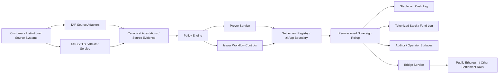
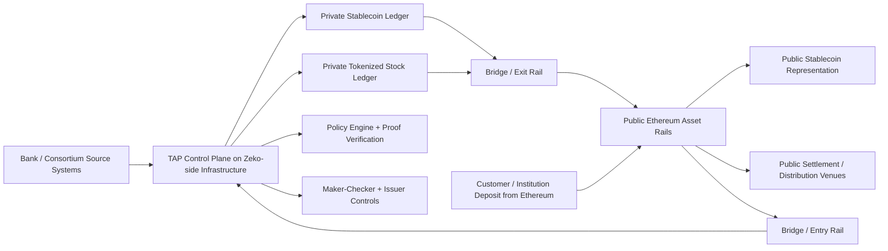
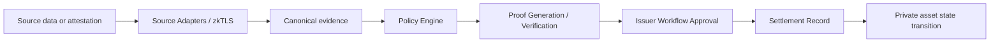
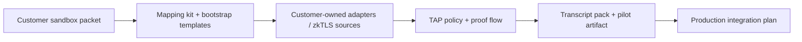

# Private Tokenized Asset Protocols Are Finally Practical

## Building TAP: a private, permissioned, sovereign-rollup control plane for stablecoins and tokenized stocks

The first generation of tokenization proved demand.

It did not solve the real institutional problem.

Most tokenized assets today are issued into a fully public operating model, usually on Ethereum, with compliance gates bolted on around the edges. That model is easy to understand, easy to market, and increasingly easy to copy.

It is also a weak long-term foundation.

Public-first tokenization creates a market structure that is:

- privacy-destructive
- operationally fragmented
- strategically commoditized
- weakly defensible for issuers
- awkward for real institutional workflows

If every issuer launches the same public token on the same public chain, with the same wallet rails, the same visibility model, and roughly the same gatekeeping pattern, the result is not durable differentiation. It is a race to the bottom around distribution, branding, and balance-sheet trust.

That may be enough for the first wave.

It is not enough for the institutions that will actually own the next wave.

The banks, custodians, brokers, transfer agents, and consortium operators that move first on private, permissioned tokenization infrastructure will have a much stronger moat. They will control the network, the policies, the compliance surface, the data relationships, the application ecosystem, and the bridge to public liquidity when and where they choose.

That is the design space behind TAP: the Tokenized Asset Protocol.

TAP is a self-hostable control plane for private asset tokenization. It is designed for permissioned consortium environments built around sovereign rollup patterns, private execution, proof-linked compliance, and optional settlement or interoperability rails to Ethereum.

The core thesis is straightforward:

- stablecoins are the cash leg
- tokenized stocks, funds, and other RWAs are the risk-asset leg
- identity, balance, holdings, and suitability data should stay off-chain
- policy should be explicit, versioned, and auditable
- state transitions should be governed by proofs and approvals, not by blind trust in application code
- public chains should be bridge rails, not the default home for the full operating system

That combination opens up something earlier tokenization systems could not really deliver: private two-way markets with regulated controls, institutional-grade permissions, customer-data minimization, and optional public-chain distribution at the edge.

## Why the current public-chain model is not enough

Public Ethereum has been the easiest place to launch tokenized assets.

That does not make it the right place to build the full institutional operating model.

The current pattern has several structural weaknesses.

### 1. It exposes too much

A fully public tokenization stack leaks more than most institutions actually want to reveal:

- issuance timing
- transfer timing
- address-level behavior
- treasury patterns
- ecosystem composition
- network relationships between customers, market makers, counterparties, and service providers

Even when names are not directly visible, the activity graph itself is valuable information.

For regulated institutions, that is not a cosmetic downside. It is a strategic and operational problem.

### 2. It turns tokenization into a commodity

If tokenization means issuing a public ERC-20 or similar public asset wrapper with off-chain gating, then the market converges quickly:

- same chain
- same wallet patterns
- same public state model
- same asset visibility
- same distribution logic
- same integration surface

That makes the token itself easy to copy and the surrounding product increasingly hard to defend.

The first institutions to move beyond that model and build private consortium rails will own a much stronger moat.

### 3. It keeps compliance at the edge instead of in the transition logic

A lot of current systems say they are compliant, but what they really mean is:

- run a check before onboarding
- maintain an allowlist
- block obvious violations when possible

That is not the same as a policy-linked state machine.

The future institutional model needs:

- versioned policies
- deterministic policy hashes
- source evidence linked to decisions
- proof-linked approvals
- explicit issuer controls
- auditable settlement decisions

In other words, compliance cannot just surround the protocol. It has to be part of the protocol’s actual operating logic.

### 4. It confuses public settlement with public execution

The real opportunity is not “everything private forever” and it is not “everything public by default.”

It is a layered model:

- private execution and control inside the consortium environment
- optional public settlement, distribution, or interoperability through bridge rails

This is a much better fit for how institutions actually want to operate.

## What TAP is

TAP is a self-hostable control plane for private tokenized asset workflows.

It is designed so a bank, issuer, broker, custodian, or consortium can run its own environment and control:

- who is allowed in
- what source systems are trusted
- what policies are active
- how mint, burn, issue, allocate, restrict, and redeem actions are approved
- how proof-backed decisions are settled
- when assets move to or from public Ethereum rails

Today, the repository includes:

- a multi-package backend control plane
- policy versioning and settlement-time policy linkage
- maker-checker issuer workflows
- real `o1js` proof runtime paths
- zkTLS-backed source integration
- partner API adapter infrastructure
- stablecoin lifecycle flows
- tokenized stock lifecycle flows
- a dual-asset flagship transcript
- a customer-owned sandbox integration kit
- public runbooks, onboarding packets, and pilot materials

This is not a single showcase app. It is a real protocol and operator surface.

At a high level:

- `apps/api-gateway` is the main control plane API
- `packages/policy-engine` manages versioned policy state
- `packages/prover-service` manages proof verification lanes
- `packages/source-adapters` connects external systems
- `packages/attestor-service` handles statement, phone, and zkTLS attestation flows
- `packages/compliance-engine` evaluates policy outcomes
- `packages/contracts` defines the settlement or zkApp boundary
- `packages/bridge-service` defines the bridge orchestration layer
- `scripts/` packages the operating flows, transcript generation, and customer onboarding path

## The architecture

The architecture starts from a simple institutional reality:

customer truth and business truth usually live outside the blockchain.

Those truths live in:

- bank balance APIs
- KYC providers
- holdings and custody ledgers
- treasury systems
- issuer systems of record
- private HTTPS systems that can be proven via zkTLS

TAP does not try to shove those systems directly on-chain.

Instead, it normalizes them into a private control plane where source evidence, policy, proofs, and approvals all contribute to whether an asset state transition is allowed.

### Control plane overview

This is not just a proof pipeline.

It is a private state-transition control plane where:

- source truth stays off-chain
- compliance logic is explicit and durable
- approvals are operationally real
- settlement artifacts are auditable
- private asset state is not exposed by default

### Private operating layer vs public bridge rails

This is the split that matters:

- Zeko-side infrastructure is the private operating environment
- Ethereum is the public interoperability and distribution rail
- the bridge is the controlled path between the two

That is the right posture for institutions.

Zeko or Mina-style infrastructure is where proof-heavy logic, recursive verification, private control, and permissioned execution belong.

Ethereum remains the most important public settlement and distribution rail.

The future is not choosing one and rejecting the other. It is using each for what it is actually best at.

### Proof-linked state transition flow

This is the core TAP claim.

A private asset should not move because an application says it should move. It should move because:

- the source data is trusted
- the policy is current
- the proof verifies
- the approval path is satisfied
- the settlement record is durable

That is a much stronger institutional model.

### Customer-owned integration path

This matters just as much as the protocol design.

TAP is not meant to be a closed hosted product that only works with a fixed set of vendors. The public repo proves the architecture. The customer-owned integration path proves how a real bank or consortium can bring its own sandbox and turn the repo into a real pilot.

## Why Zeko-style infrastructure matters here

The private side of this architecture needs a proof-native operating environment.

That is where Zeko and Mina-style infrastructure becomes important.

What is native to this side of the system:

- proof-centric application logic
- recursive proof composition
- data-minimized state transitions
- permissioned control planes
- richer off-chain execution with on-chain proof settlement
- application-specific state models that do not have to expose full business context publicly

That is exactly the shape you want for:

- private stablecoin issuance
- private transfer compliance
- tokenized equity restrictions
- consortium governance
- institution-to-institution workflows

Ethereum can still be the public bridge surface.

But it should not be forced to be the full private operating system.

## Why the first banks to do this well will build a moat

A bank that launches a public stablecoin on a public chain gets some distribution and some attention.

A bank or consortium that launches the full private operating layer gets something much more valuable.

It gets:

- private network effects
- customer-data advantage without public leakage
- policy and compliance infrastructure embedded in the platform
- differentiated application workflows on top of the asset rail
- institutional interoperability inside a governed ecosystem
- control over how and when public-chain access happens

That is a real moat.

The token itself is not the moat.

The operating environment is the moat.

The proof system is the moat.

The consortium rails are the moat.

The application ecosystem built on top of a private settlement layer is the moat.

If the industry stays trapped in the “issue publicly and gate access at the edges” model, then stablecoins and tokenized assets become increasingly fractionalized and commoditized. Issuers become wrappers around public rails instead of owners of differentiated infrastructure.

The institutions that move earlier toward private consortium tokenization will be in a much stronger position.

## What we implemented in TAP

Over the course of this build, TAP moved from concept to a working pilot scaffold.

We implemented:

- versioned policy registry with deterministic hashes
- settlement-time policy enforcement
- maker-checker issuer workflows
- stablecoin mint and burn paths
- tokenized stock issue, allocate, restrict, and redeem paths
- real `o1js` proof runtime lanes
- pluggable verifier contract for proof verification
- zkTLS-backed source integration
- bank-profile zkTLS source flow
- partner API adapter infrastructure
- tenant-scoped provider configuration
- customer sandbox onboarding and mapping kits
- one-command pilot packs and transcript verification
- a dual-asset flagship artifact that shows the cash leg and the risk-asset leg together

That matters because it turns the protocol from a thesis into something a counterparty can actually inspect, run, and adapt.

## The dual-asset model matters

A stablecoin-only story is incomplete.

A tokenized-equity-only story is incomplete.

A functioning on-chain market needs both sides:

- cash leg
- risk-asset leg

That is why TAP treats both as first-class:

- private stablecoin workflows represent the money rail
- tokenized stock workflows represent the asset rail

Together, they form the beginning of a private two-way market.

That is the real institutional opportunity.

## Reference providers are not the product

The repository includes reference integrations and templates because real systems need proving grounds.

But TAP is not a Plaid product, or a Persona product, or a custody-vendor product.

The actual commercial model is:

- show the architecture publicly
- show the proof, policy, and workflow model publicly
- show reference integrations publicly
- then work with a bank, issuer, or consortium to wire TAP into its own sandbox and systems

That is why the repo includes:

- onboarding packets
- mapping kits
- bootstrap templates
- customer-owned dual-asset examples
- public and redacted transcript packs

The point is not to trap customers inside one vendor set.

The point is to make private tokenization infrastructure legible, forkable, and adaptable.

## What the bridge rails mean in practice

The phrase “Ethereum bridge rails” can sound vague, but the operating model is simple.

On the private side:

- assets are issued, transferred, and controlled inside the permissioned consortium environment
- balances and internal state can remain private
- proof-linked compliance and issuer governance control the transitions

On the public side:

- equivalent or wrapped public assets can be minted, released, locked, or redeemed
- public wallets, venues, and liquidity can interact with those public representations

The bridge is the controlled handoff between those environments.

For stablecoins, this means:

- private bank stablecoin inside the consortium
- public stablecoin representation on Ethereum when needed

For tokenized equities, it may mean:

- private restricted asset inside the consortium
- limited or selective external settlement representation depending on regulation and venue design

The important point is that public Ethereum becomes a rail, not the whole world.

## Why this becomes practical now

This architecture is becoming practical because several things now exist at the same time:

- better proof-native execution environments
- better recursive proof infrastructure
- better ways to bring off-chain facts into on-chain state transitions
- zkTLS and attestation tooling
- stronger demand for institutional privacy and control
- real need for tokenized cash and tokenized risk assets to coexist

The timing matters.

The first public wave of tokenization created market awareness.

The next wave will be defined by private infrastructure, institutional controls, and selective public interoperability.

## Where this goes next

The path from here is straightforward:

- banks and issuers bring their own sandbox APIs and source systems
- TAP is wired into those systems through adapter mode or zkTLS mode
- policies, approvals, and asset workflows are tuned to the real operating model
- private consortium rails become the core system
- Ethereum remains the public bridge layer when it is useful

That is the future shape of tokenized assets.

Not everything public.

Not everything closed.

Private where institutions need privacy.
Public where markets need interoperability.
Proofs and policy in the middle.

That is the model TAP is built for.
